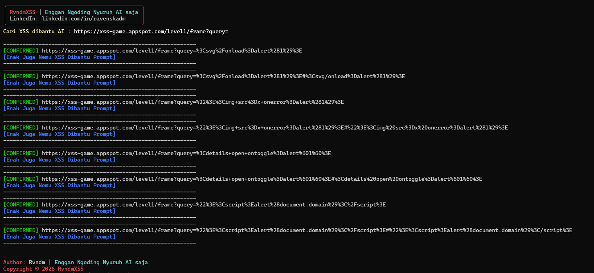
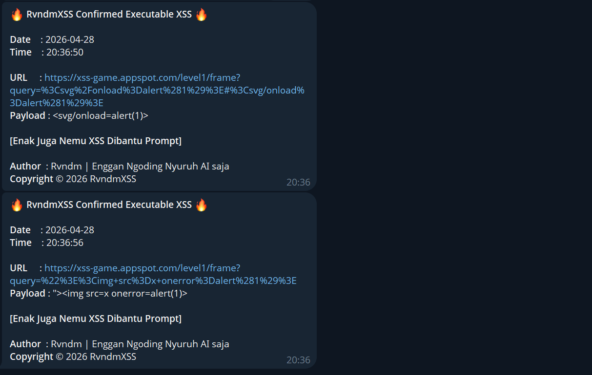

# RvndmXSS

> Stealth Browser Confirmed XSS Scanner


Author: **Rvndm | Enggan Ngoding Nyuruh AI saja**  
LinkedIn: https://www.linkedin.com/in/ravenskadm/

---

## Features
- Browser confirmed executable XSS only
- DOM based XSS validation
- WAF bypass payload support
- Telegram notification report
- Clean confirmed-only output
- Ctrl+C traceback suppressed

---

## Installation
```bash
bash setup.sh
```

---

## Usage
```bash
python3 rvndmxss.py -u "https://target.com/search?q="
python3 rvndmxss.py -l urls.txt
python3 rvndmxss.py -u "https://target.com/search?q=" -p payloads/custom.txt
```

---

## Result Preview
> Result in Terminal

<br><br>
> Result in Telegram


---

## Telegram Setup
Edit `config.py` and fill:
```python
TELEGRAM_BOT_TOKEN="YOUR_BOT_TOKEN"
TELEGRAM_CHAT_ID="YOUR_CHAT_ID"
```

---

## Disclaimer
Use only on systems you are authorized to test.

---

Copyright © 2026 RvndmXSS
